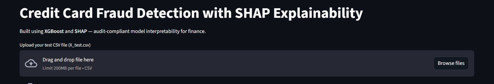
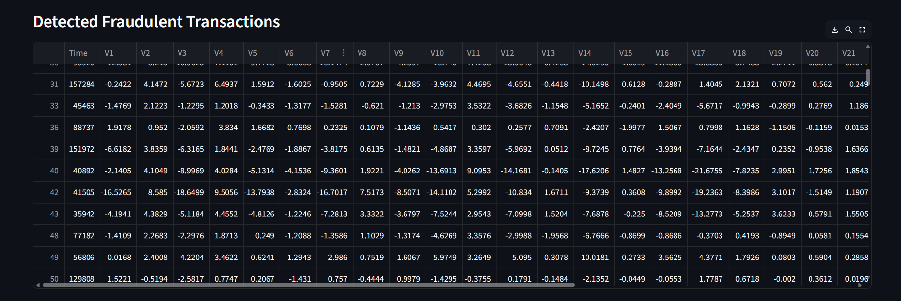
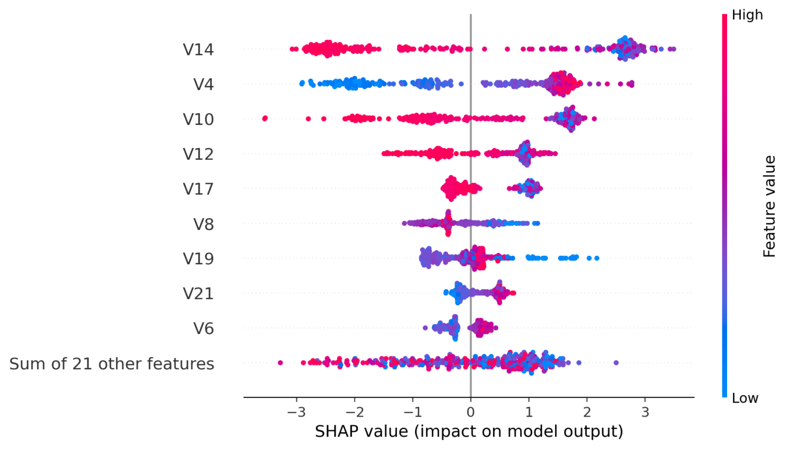
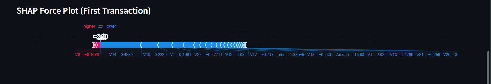

Credit Card Fraud Detection with SHAP Explainability

Live App:[(https://credit-card-fraud-shap-rp5r4u4gtkqk3gaf6x9b7x.streamlit.app/)](https://credit-card-fraud-shap-rp5r4u4gtkqk3gaf6x9b7x.streamlit.app/)

Overview
 This project detects fraudulent credit card transactions using XGBoost and explains predictions with SHAP to ensure model transparency and compliance with financial auditing standards.
 The solution is deployed as an interactive Streamlit dashboard, allowing real-time fraud prediction and detailed interpretability visualizations.

Features
 Real-time fraud prediction using XGBoost
 Fraud probability score for every transaction
 SHAP Summary Plot for global feature importance
 SHAP Force Plot for individual prediction explainability
 Deployed on Streamlit Cloud for easy access

Tech Stack
 Language: Python 3.10+
 ML Algorithm: XGBoost
 Explainability: SHAP
 Web App: Streamlit
 Other Libraries: Pandas, Matplotlib, Scikit-learn, Joblib

Project Structure

credit-card-fraud-shap/
 app.py                # Main Streamlit dashboard  -- -
 shap_explainer.py    # Script for standalone SHAP analysis ---
  requirements.txt      # Required Python packages ---
  models -
   xgb_model.pkl     # Trained XGBoost model ---
 data -
  X_test.csv        # Sample input for testing ---
 notebooks -
  eda_cc.ipynb      # EDA & model training notebook ---
 screenshots -
 Dashboard.png ,
 Detected_Fraudulent_Transactions.png .
 SHAP_summary_plot.png .
 Force_plot.png   ---
 README.md             # Project documentation

Model Explainability
SHAP Summary Plot: Highlights which features have the most influence globally across all predictions.
SHAP Force Plot: Explains individual predictions, showing why a transaction was classified as fraud.

Screenshots
  Dashboard - 
  Fraud Detection Table- 
  SHAP Summary Plot-
  SHAP Force Plot-

Future Enhancements
  Export fraud predictions as downloadable CSV
  Add ROC curve visualization in the app
  Implement user authentication for secure access
  Detected Fraudulent Transactions.png
  SHAP Summary Plot.png
  screenshots/Shap Force Plot.png

